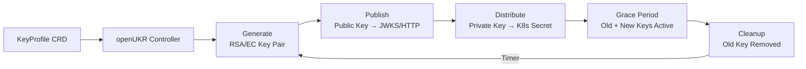
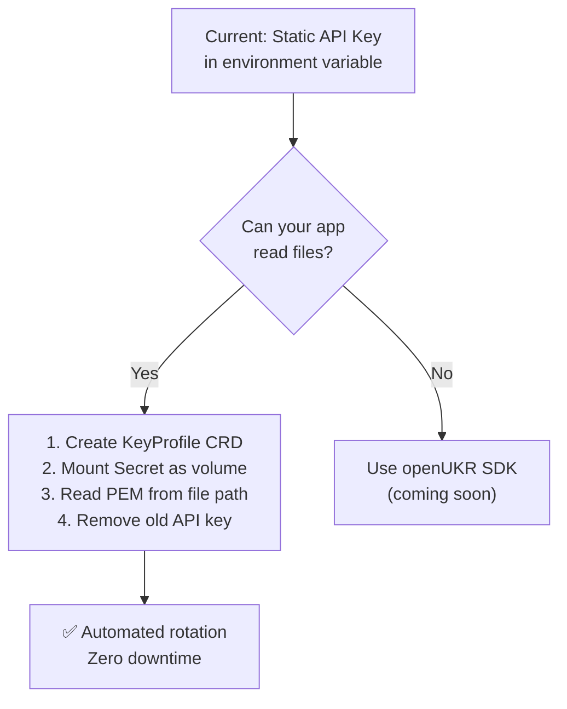

<](LICENSE)
[](https://go.dev)
[](https://kubernetes.io)

</div>

<!-- ──────────────────────────────────────────────────────────────── -->
<!-- PRE-RELEASE BANNER — Remove this entire block once v1.0.0 is  -->
<!-- officially tested, security-audited and released.              -->
<!-- ──────────────────────────────────────────────────────────────── -->

> [!CAUTION]
> **⚠️ Pre-Release Software — Do NOT use in production!**
>
> openUKR is under active development and has **not yet been fully tested or security-audited**.
> The project is not yet published on GitHub and no official release exists.
>
> **What this means:**
> - The code has not undergone a formal security audit
> - End-to-end tests have not been executed against a live cluster
> - The API surface (`v1alpha1`) may change without notice
> - No SLA, support, or stability guarantees are provided
>
> **Do not use this software for managing real cryptographic keys in any environment.**
> If you are evaluating openUKR, please do so only in isolated test clusters.

<!-- END PRE-RELEASE BANNER -->

---

## The Problem

Static API keys are everywhere — and they're a systemic security risk:

```
┌─────────────────────────────────────────────────────────────────┐
│  ❌  Static API Key                                            │
│                                                                 │
│  • Never expires → compromised keys stay valid forever          │
│  • Manual rotation → causes downtime and human error            │
│  • Shared across services → one breach = lateral movement       │
│  • No audit trail → impossible to trace usage                   │
│  • Hardcoded in config → leaks via Git, logs, error messages    │
└─────────────────────────────────────────────────────────────────┘
```

## The Solution

openUKR replaces static keys with **short-lived, automatically rotated asymmetric key pairs**:

```
┌─────────────────────────────────────────────────────────────────┐
│  ✅  openUKR Managed Identity                                  │
│                                                                 │
│  • Auto-rotated → configurable intervals (e.g. every 24h)      │
│  • Zero downtime → graceful 4-phase rotation with grace period  │
│  • Per-service identity → unique key pair per ServiceAccount    │
│  • Full audit trail → every rotation event logged               │
│  • Universal interface → PEM files readable by any language     │
└─────────────────────────────────────────────────────────────────┘
```

---

## How It Works



1. **You declare** a `KeyProfile` CRD mapping a ServiceAccount to a key configuration
2. **openUKR generates** an asymmetric key pair (RSA or EC — both equally supported)
3. **Public key is published** to your chosen targets (JWKS endpoint, filesystem, or custom)
4. **Private key is distributed** as a Kubernetes Secret, mounted into your pods
5. **After a grace period**, the old key is removed — zero downtime

---

## Quick Start

### Prerequisites
- Kubernetes cluster (v1.28+)
- Helm 3

### Install

**Via Helm (from source):**
```bash
helm install openukr ./charts/openukr -n openukr-system --create-namespace
```

**Via Kustomize (from source):**
```bash
kubectl apply -k config/default
```

### Create a Key Profile

```yaml
apiVersion: openukr.io/v1alpha1
kind: KeyProfile
metadata:
  name: my-service-identity
  namespace: default
spec:
  serviceAccountRef:
    name: my-service
    namespace: default
  keySpec:
    algorithm: EC
    params:
      curve: P-256
    encoding: PEM
  rotation:
    interval: 24h
    gracePeriod: 2h
  output:
    secretName: my-service-keys
    format: split-pem
```

### Mount in Your Application

```yaml
spec:
  containers:
    - name: app
      volumeMounts:
        - name: keys
          mountPath: /var/run/openukr/keys
          readOnly: true
  volumes:
    - name: keys
      secret:
        secretName: my-service-keys
```

### Read Keys (Any Language)

Keys are standard PEM files — read them like any other file:

<table>
<tr><th>Go</th><th>Python</th></tr>
<tr><td>

```go
keyPEM, _ := os.ReadFile(
    "/var/run/openukr/keys/current.key",
)
key, _ := x509.ParseECPrivateKey(keyPEM)
```

</td><td>

```python
from cryptography.hazmat.primitives import serialization

with open("/var/run/openukr/keys/current.key", "rb") as f:
    key = serialization.load_pem_private_key(f.read(), password=None)
```

</td></tr>
<tr><th>Java</th><th>Rust</th></tr>
<tr><td>

```java
byte[] keyBytes = Files.readAllBytes(
    Path.of("/var/run/openukr/keys/current.key")
);
```

</td><td>

```rust
let pem = std::fs::read_to_string(
    "/var/run/openukr/keys/current.key"
)?;
```

</td></tr>
</table>

**No SDK required.** Standard file I/O is all you need.

---

## Architecture at a Glance

| Component | Description |
|---|---|
| **KeyProfile CRD** | Declarative config: ServiceAccount → key specification |
| **Rotation Controller** | 4-phase lifecycle: Generate → Publish → Distribute → Cleanup |
| **Crypto Engine** | RSA (2048–4096) and EC (P-256/P-384/P-521) via Go stdlib — both equally supported |
| **Publisher Plugins** | Modular public key export: HTTP (JWKS endpoint), Filesystem |
| **Audit Logger** | Structured JSON logs + Kubernetes Events |

### The 4-Phase Rotation Cycle

```
  ┌──────────┐     ┌──────────┐     ┌─────────────┐     ┌──────────┐
  │ GENERATE │ ──▶ │ PUBLISH  │ ──▶ │ DISTRIBUTE  │ ──▶ │ CLEANUP  │
  │          │     │          │     │             │     │          │
  │ New key  │     │ Pub key  │     │ Priv key    │     │ Old key  │
  │ pair     │     │ → S3/HTTP│     │ → K8s Secret│     │ removed  │
  └──────────┘     └──────────┘     └─────────────┘     └──────────┘
                                          │
                                    ┌─────┘
                                    ▼
                              Grace Period
                              (old + new keys
                               both active)
```

> **Key invariant**: Public key is always published *before* the private key is distributed. This ensures validators can verify tokens from the moment they're signed.

---

## Secret Formats

| Format | Files | Best For |
|---|---|---|
| `split-pem` *(default)* | `current.key`, `current.pub`, `metadata.json` | General purpose |
| `bundle-json` | `keys.json` | Config-driven apps |
| `jwks` | `jwks.json`, `private-jwks.json`, `metadata.json` | JWT/OIDC workloads |

📖 See the [Roadmap](https://github.com/openukr/.github/blob/main/ROADMAP.md) for planned additional formats.

---

## Migrating from Static API Keys



---

## Documentation

| Document | Description |
|---|---|
| [Compliance Guide](https://github.com/openukr/.github/blob/main/docs/operations/COMPLIANCE_GUIDE.md) | Operational requirements (etcd encryption, NTP, DPIA) |
| [Disaster Recovery](https://github.com/openukr/.github/blob/main/docs/operations/DISASTER_RECOVERY.md) | RTO/RPO definitions and recovery procedures |
| [Security Policy](https://github.com/openukr/.github/blob/main/SECURITY.md) | Hardening details, vulnerability reporting, and compliance mapping |
| [Roadmap](https://github.com/openukr/.github/blob/main/ROADMAP.md) | Planned features and version milestones |

---

## Contributing

We welcome contributions! Please see our [Contributing Guidelines](https://github.com/openukr/.github/blob/main/CONTRIBUTING.md).

### Development Setup

```bash
# Prerequisites: Go 1.22+, Docker, kind

make manifests    # Generate CRD YAML & RBAC
make test         # Run unit & integration tests (requires envtest)
make run          # Run controller locally against active cluster
```

---

## License

Apache License 2.0 — see [LICENSE](LICENSE) for details.
]]>
